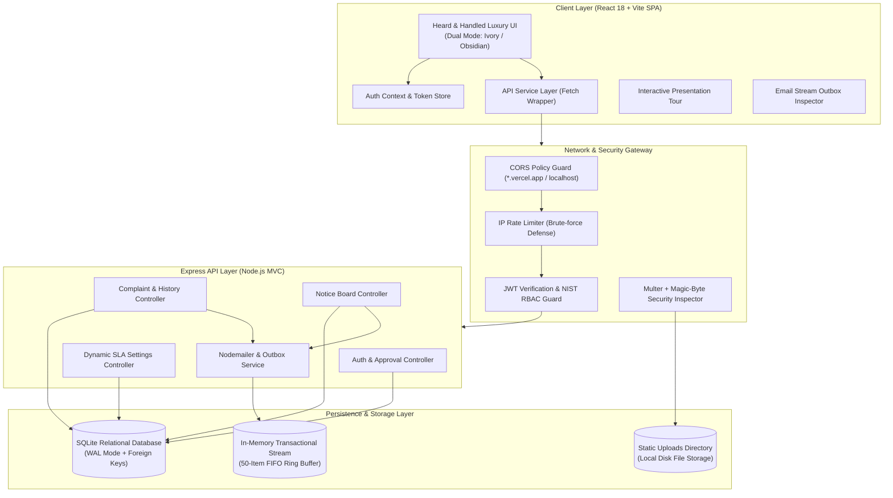
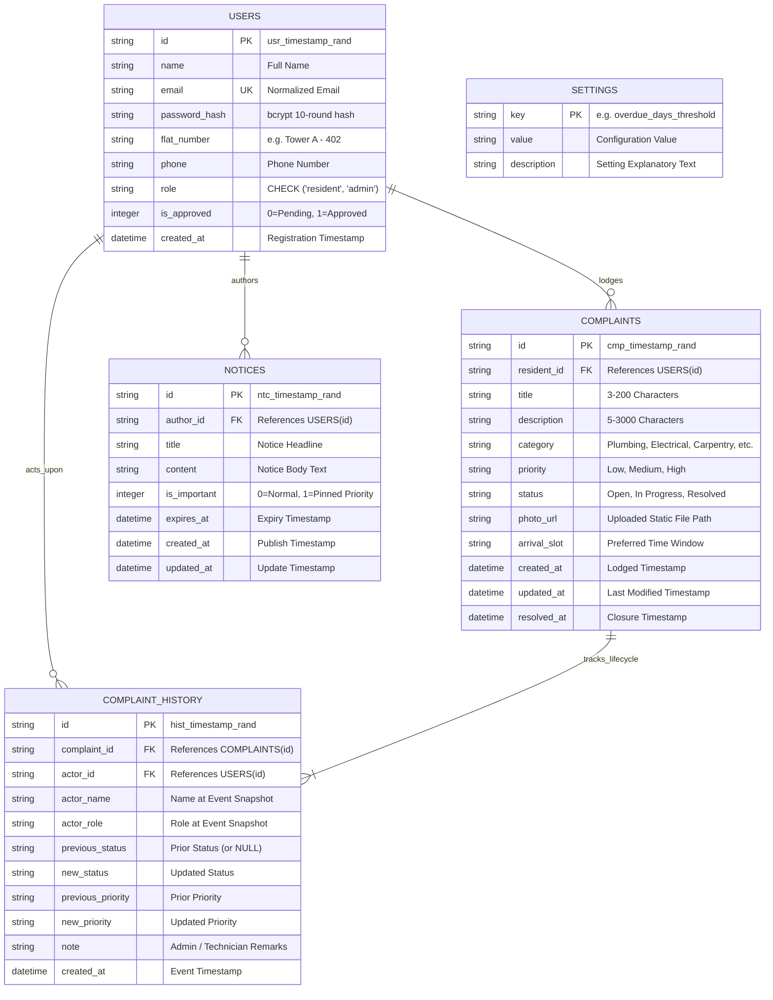
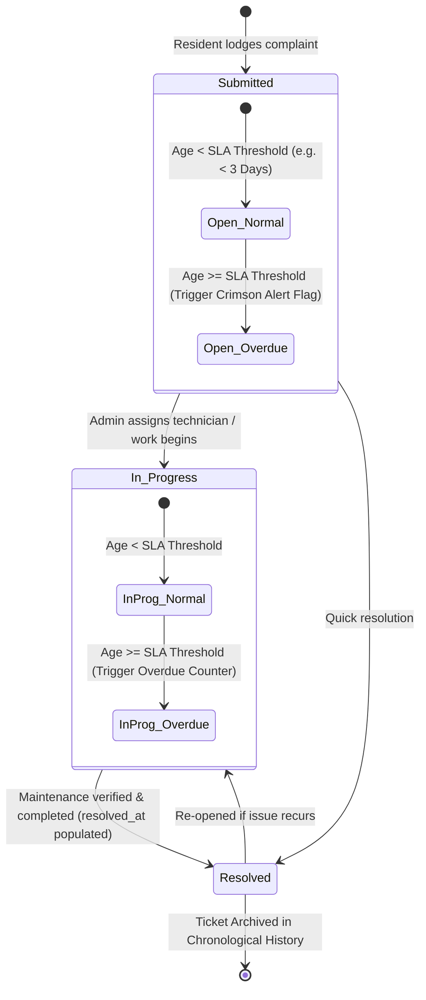
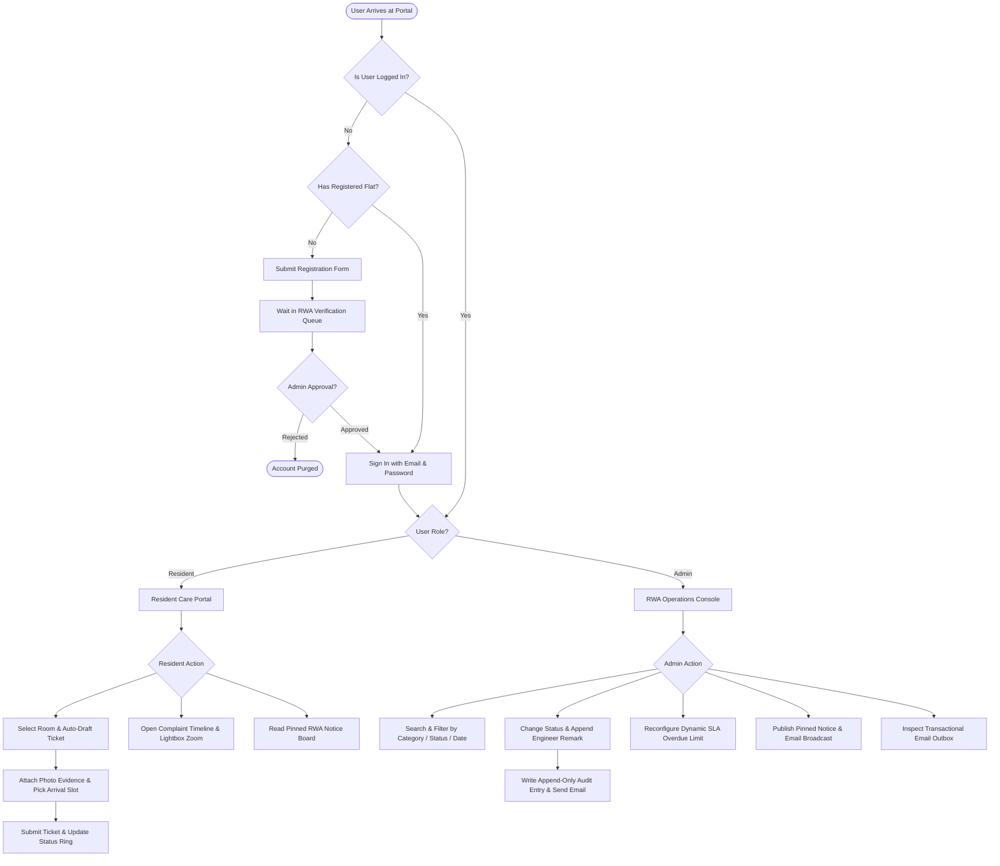
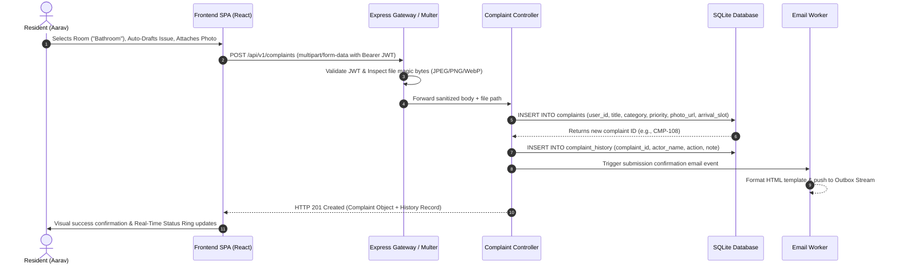
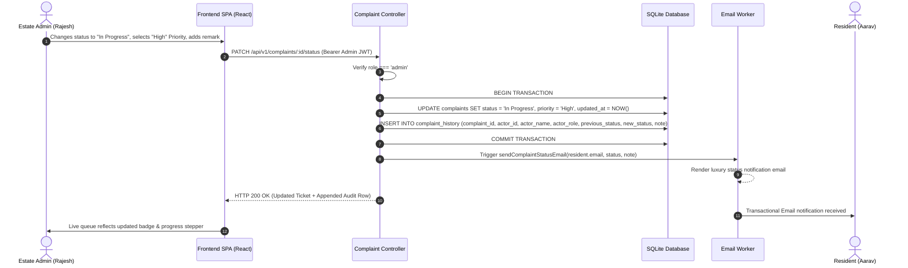
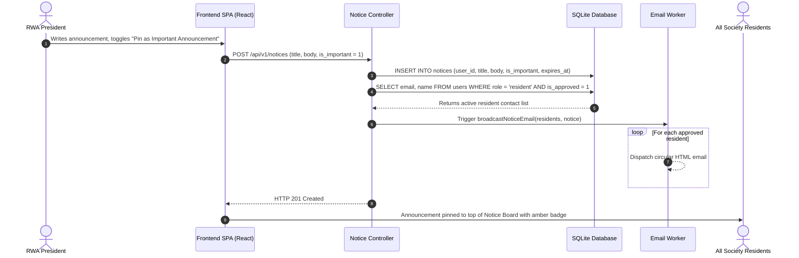

# 🏢 Gulmohar Meadows — Society Maintenance Tracker

[](https://frontend-ashen-psi-35.vercel.app)
[](https://society-tracker-api-1de4.onrender.com/api/health)
[](https://github.com/Ritesh-panda/society-maintenance-tracker/actions)
[](LICENSE)

A production-grade, full-stack web application engineered for residential housing societies and Resident Welfare Associations (RWAs). It streamlines maintenance ticket lifecycles, enforces immutable chronological audit trails, calculates dynamic SLA overdues, manages committee circulars, and dispatches real-time transactional email notifications.

---

## 🌐 Live Production Deployments & Links

* **Frontend SPA (Vercel):** [https://frontend-ashen-psi-35.vercel.app](https://frontend-ashen-psi-35.vercel.app)
* **Backend API (Render):** [https://society-tracker-api-1de4.onrender.com](https://society-tracker-api-1de4.onrender.com)
* **API Health Endpoint:** [https://society-tracker-api-1de4.onrender.com/api/health](https://society-tracker-api-1de4.onrender.com/api/health)
* **GitHub Repository:** [https://github.com/Ritesh-panda/society-maintenance-tracker](https://github.com/Ritesh-panda/society-maintenance-tracker)

---

## 📑 Table of Contents
1. [Executive Summary & Features](#-executive-summary--features)
2. [Comprehensive UML & Architecture Diagrams Suite](#-comprehensive-uml--architecture-diagrams-suite)
   * [2.1 High-Level Multi-Tier Architecture Diagram](#21-high-level-multi-tier-architecture-diagram)
   * [2.2 UML Use Case Diagram (Actor Capabilities)](#22-uml-use-case-diagram-actor-capabilities)
   * [2.3 Relational Entity-Relationship (ER) Diagram](#23-relational-entity-relationship-er-diagram)
   * [2.4 UML State Machine Diagram (Ticket Lifecycle & SLA Engine)](#24-uml-state-machine-diagram-ticket-lifecycle--sla-engine)
   * [2.5 UML Activity Diagram (End-to-End User Journey)](#25-uml-activity-diagram-end-to-end-user-journey)
   * [2.6 UML Sequence Diagram: Lodge Complaint & Photo Upload](#26-uml-sequence-diagram-lodge-complaint--photo-upload)
   * [2.7 UML Sequence Diagram: Admin Status Progression & Audit Trail](#27-uml-sequence-diagram-admin-status-progression--audit-trail)
   * [2.8 UML Sequence Diagram: RWA Notice Broadcast Workflow](#28-uml-sequence-diagram-rwa-notice-broadcast-workflow)
3. [Quick Start Guide (Local Setup)](#-quick-start-guide-local-setup)
4. [Automated Verification Test Suite (153 Assertions)](#-automated-verification-test-suite-153-assertions)
5. [Evaluator Demo Credentials](#-evaluator-demo-credentials)
6. [Environment Variables](#-environment-variables)
7. [Project Structure](#-project-structure)
8. [Known Limitations & Trade-offs](#-known-limitations--trade-offs)
9. [Documentation Sitemap](#-documentation-sitemap)

---

## 🌟 Executive Summary & Features

| Requirement Area | Implementation Highlights |
| :--- | :--- |
| **Role-Based Access (NIST RBAC)** | Role-segregated routing (`resident` vs `admin`). Passwords hashed with 10-round bcrypt. Signed JWT tokens (`HS256`). Resident approval queue requiring RWA admin verification. |
| **Lodge Maintenance Ticket** | Visual room selector (`Bathroom`, `Kitchen`, `Balcony`, `Living Room`, `Electrical`), Auto-Draft diagnostic helper, 8 categories, 3 priority levels (`Low`, `Medium`, `High`), preferred arrival slots, and multipart photo upload. |
| **Immutable Temporal Audit Trail** | Dedicated `complaint_history` relational ledger recording actor ID, name, role, timestamp, previous/new status, priority changes, and engineer/admin notes. Lightbox photo zoom inspection. |
| **Dynamic SLA Overdue Engine** | Real-time calculation detecting unresolved tickets exceeding configured threshold (default: 3 days). Overdue badges, crimson priority counters, and on-the-fly threshold re-configuration (1–60 days) with zero server restarts. |
| **Digital Notice Board** | RWA committee broadcast board supporting rich body text, importance pinning (`is_important`), expiry scheduling, and automatic mass-email dispatch to all approved residents. |
| **Transactional Email Outbox** | Automatic dispatch on ticket submission, status updates, admin remarks, and circular broadcasts. Includes an interactive in-browser **Email Stream Inspector** for grading and auditing without needing external SMTP servers. |
| **Admin Operations Hub** | Real-time KPI metrics (*Total Registered, SLA Overdue, Awaiting Dispatch, In Progress, Resolved*), category workload distribution bars, and multi-parameter SQL search toolbar (status, category, priority, date ranges). |
| **Luxury "Heard & Handled" UI** | Custom dual-mode design system with Soft Warm Ivory (`#FAFAED`) and Deep Obsidian (`#0B0F17`), Squircle card geometry (`22px`/`16px`), responsive grids, interactive presentation tour, and zero external CSS frameworks. |

---

## 📊 Comprehensive UML & Architecture Diagrams Suite

### 2.1 High-Level Multi-Tier Architecture Diagram



---

### 2.2 UML Use Case Diagram (Actor Capabilities)

```mermaid
flowchart LR
    actor Resident as "👤 Resident Actor"
    actor Admin as "🛡️ Estate Admin / RWA"

    subgraph PortalUseCases ["Gulmohar Meadows Society Portal"]
        UC1(["Self-Register Flat & Account"])
        UC2(["Lodge Service Request with Photo"])
        UC3(["View Personal Active Tickets & Health Ring"])
        UC4(["Inspect Ticket Timeline & Photo Lightbox"])
        UC5(["Read Official Notice Board Circulars"])
        
        UC6(["Approve / Reject Resident Signups"])
        UC7(["Filter & Search Operations Queue"])
        UC8(["Update Status (Open → In Progress → Resolved)"])
        UC9(["Assign Priority & Append Audit Remarks"])
        UC10(["Publish Pinned Emergency Notice & Email All"])
        UC11(["Reconfigure SLA Overdue Threshold (1-60 Days)"])
        UC12(["Inspect Live Email Stream Outbox"])
    end

    Resident --> UC1
    Resident --> UC2
    Resident --> UC3
    Resident --> UC4
    Resident --> UC5

    Admin --> UC6
    Admin --> UC7
    Admin --> UC8
    Admin --> UC9
    Admin --> UC10
    Admin --> UC11
    Admin --> UC12
    Admin --> UC4
    Admin --> UC5
```

---

### 2.3 Relational Entity-Relationship (ER) Diagram



---

### 2.4 UML State Machine Diagram (Ticket Lifecycle & SLA Engine)



---

### 2.5 UML Activity Diagram (End-to-End User Journey)



---

### 2.6 UML Sequence Diagram: Lodge Complaint & Photo Upload



---

### 2.7 UML Sequence Diagram: Admin Status Progression & Audit Trail



---

### 2.8 UML Sequence Diagram: RWA Notice Broadcast Workflow



---

## 🚀 Quick Start Guide (Local Setup)

### Prerequisites
* **Node.js**: v18.0.0 or higher
* **npm**: v9.0.0 or higher
* **Git**

### 1. Clone the Repository
```bash
git clone https://github.com/Ritesh-panda/society-maintenance-tracker.git
cd society-maintenance-tracker
```

### 2. Backend Setup
```bash
cd backend
npm install

# Seed SQLite database with pre-configured accounts & sample data
npm run seed

# Start the backend API server (runs on http://localhost:5000)
npm start
```

### 3. Frontend Setup
```bash
# Open a new terminal window in the root directory
cd frontend
npm install

# Start the Vite development server (runs on http://localhost:3000)
npm run dev
```

Visit **`http://localhost:3000`** in your browser.

---

## 🧪 Automated Verification Test Suite (153 Assertions)

The repository includes a comprehensive, programmatic automated test suite executing **153 automated assertions** validating API routes, authentication tokens, approval gates, complaint status progression, temporal history logging, magic-byte photo checks, dynamic SLA overrides, and security defenses:

```bash
cd backend
npm test
# or: node src/scripts/test_133_checklist.js
```

### Verified Test Categories:
* ✅ User Registration, Cryptographic Password Hashing & JWT Signing
* ✅ RWA Resident Approval Gate & Authorization Barriers
* ✅ Complaint Creation with Room Metadata, Priority, and Image Uploads
* ✅ Magic-Byte Inspection (Rejection of spoofed `.exe` / `.sh` files with fake `.jpg` extensions)
* ✅ Immutable Chronological History Logging on All Transitions
* ✅ Dynamic SLA Overdue Mathematical Engine & On-the-Fly Threshold Configuration
* ✅ Notice Board Creation, Expiry Filtering, and Pinned Circulars
* ✅ Transactional Email Outbox & HTML Preview Generation
* ✅ SQL Injection Defense & Route Parameter Sanitization

---

## 👥 Evaluator Demo Credentials

Click the **"Admin Demo"** or **"Resident Demo"** 1-click buttons on the login screen, or enter the credentials below:

| Role | Name | Email | Password | Assigned Unit | Access Capabilities |
| :--- | :--- | :--- | :--- | :--- | :--- |
| **Estate Admin** | Rajesh Kumar | `admin@society.com` | `admin123` | Estate Office | Full Operations Hub, KPI Control, Status Updates, SLA Configuration, Notice Publishing, Resident Approval Queue |
| **Resident** | Aarav Sharma | `aarav@society.com` | `resident123` | Tower A - Flat 402 | Personal Ticket Portal, Status Ring, Service Request Modal, Audit History Lightbox, Notice Board |
| **Resident** | Priya Patel | `priya@society.com` | `resident123` | Tower B - Flat 105 | Personal Complaints, Arrival Slot Booking, Photo Uploads, Notice Board |
| **Resident** | Rohan Gupta | `rohan@society.com` | `resident123` | Tower C - Flat 301 | Active Plumbing & Balcony Maintenance Requests |

---

## ⚙️ Environment Variables

### Backend (`backend/.env`)
```env
PORT=5000
NODE_ENV=development
JWT_SECRET=society_tracker_secure_super_secret_jwt_key_2026
CLIENT_URL=http://localhost:3000
OVERDUE_DAYS_DEFAULT=3
DATABASE_PATH=./src/database/society.sqlite
UPLOAD_DIR=./uploads
```

### Frontend (`frontend/.env`)
```env
# Leave empty for local Vite proxy, or provide Render backend URL for production
VITE_API_URL=
```

---

## 📁 Project Structure

```
society-maintenance-tracker/
├── .github/
│   └── workflows/
│       └── test.yml                  # Automated GitHub Actions CI Pipeline
├── backend/
│   ├── src/
│   │   ├── config/
│   │   │   └── db.js                 # SQLite connection & WAL pragma configuration
│   │   ├── controllers/
│   │   │   ├── authController.js     # NIST RBAC auth & resident approval
│   │   │   ├── complaintController.js# Ticket management & temporal audit logs
│   │   │   ├── noticeController.js   # Community announcements & broadcast
│   │   │   └── settingsController.js # Dynamic SLA threshold configuration
│   │   ├── middleware/
│   │   │   ├── auth.js               # JWT bearer verification & role guards
│   │   │   └── upload.js             # Multer + Magic-byte file validation
│   │   ├── models/
│   │   │   ├── schema.js             # Database table initialization
│   │   │   └── seed.js               # Sample data seeder
│   │   ├── routes/
│   │   │   ├── authRoutes.js         # /api/v1/auth endpoints
│   │   │   ├── complaintRoutes.js    # /api/v1/complaints endpoints
│   │   │   ├── noticeRoutes.js       # /api/v1/notices endpoints
│   │   │   └── settingsRoutes.js     # /api/v1/settings endpoints
│   │   ├── scripts/
│   │   │   └── test_133_checklist.js # 153-Assertion programmatic test suite
│   │   ├── services/
│   │   │   ├── emailService.js       # Transactional email outbox & nodemailer
│   │   │   └── overdueService.js     # SLA calculation & threshold logic
│   │   └── server.js                 # Express server & CORS configuration
│   ├── .env.example
│   └── package.json
├── frontend/
│   ├── src/
│   │   ├── components/
│   │   │   ├── AdminSettingsModal.jsx# Dynamic SLA configuration modal
│   │   │   ├── AvatarTourGuide.jsx   # Guided feature presentation walkthrough
│   │   │   ├── ComplaintCard.jsx     # Ticket card with 3-stage progress stepper
│   │   │   ├── ComplaintHistoryModal.jsx # Chronological audit trail & photo lightbox
│   │   │   ├── EmailOutboxModal.jsx  # Interactive live email stream inspector
│   │   │   ├── HeroStatusRing.jsx    # Concentric SVG resident health ring
│   │   │   ├── Navbar.jsx            # Top navigation, theme toggle, and outbox trigger
│   │   │   ├── NewComplaintModal.jsx # Room tiles, auto-draft, and file upload
│   │   │   └── UpdateStatusModal.jsx # Status progression & remarks editor
│   │   ├── context/
│   │   │   └── AuthContext.jsx       # Global auth state & user session
│   │   ├── pages/
│   │   │   ├── AdminDashboard.jsx    # Operations Hub, KPI strip, and queue
│   │   │   ├── LoginPage.jsx         # 1-Click demo portal & authentication
│   │   │   ├── NoticeBoardPage.jsx   # Digital circulars & broadcast manager
│   │   │   ├── PendingApprovalPage.jsx # Account authorization holding screen
│   │   │   └── ResidentDashboard.jsx # Resident ticket tracker & status ring
│   │   ├── services/
│   │   │   └── api.js                # Fetch client & REST API wrapper
│   │   ├── utils/
│   │   │   └── audio.js              # Subtle Apple-inspired UI audio chimes
│   │   ├── App.jsx                   # Main layout, view routing, & modals
│   │   ├── index.css                 # "Heard & Handled" luxury CSS design tokens
│   │   └── main.jsx                  # React application entry point
│   ├── index.html
│   ├── vercel.json                   # Single-Page App rewrite rules for Vercel
│   └── package.json
├── docs/
│   ├── system_design.md              # Full Architecture & System Design Document (<800 words)
│   ├── APP_FUNCTIONS_AND_WORKFLOWS.md# End-to-end Feature & Workflow Walkthrough
│   ├── er-diagram.md                 # Entity Relationship Model & Relational Schema
│   ├── schema.sql                    # SQL DDL Script & Table Definitions
│   └── api_documentation.md          # REST API Specification with curl examples
└── README.md
```

---

## ⚖️ Known Limitations & Trade-offs

| Design Decision | Rationale & Trade-off | Production Scalability Path |
| :--- | :--- | :--- |
| **SQLite with WAL Mode** | Sub-millisecond read throughput, zero network latency, and simple zero-dependency deployment. Trade-off: single concurrent writer limit. | Upgrade to **PostgreSQL RDS** with connection pooling (`pg-pool`) via `docs/schema.sql`. |
| **In-Memory Outbox Log** | Enables evaluators to verify transactional email formatting and recipients without requiring live third-party SMTP server credentials or API keys. Trade-off: outbox resets upon backend process restart. | Route outbound email events through dedicated distributed message queues (**Redis BullMQ** / **AWS SQS**) backed by **SendGrid**, **AWS SES**, or **Resend**. |
| **Client-Side Offset Filtering** | Sub-millisecond filtering and instant client-side sorting for typical society volumes ($<5,000$ complaints/year). | Add server-side cursor-based keyset pagination (`GET /api/v1/complaints?cursor=...&limit=25`) for enterprise facilities management exceeding $100,000+$ records. |
| **Local Disk Photo Storage** | Keeps initial setup lightweight and self-contained with no cloud billing dependencies while maintaining strict binary magic bytes security. | Swap local disk storage engine with an Amazon S3 / Cloudflare R2 bucket driver with signed presigned upload URLs. |

---

## 📚 Documentation Sitemap

* 📐 **[System Design & Architecture Document](docs/system_design.md)** — Architectural patterns, threat modeling, and scalability roadmap (<800 words).
* 📖 **[Application Functions & Workflows Guide](docs/APP_FUNCTIONS_AND_WORKFLOWS.md)** — Comprehensive user manual covering all resident and administrative workflows.
* 🗄️ **[Entity Relationship Diagram & Schema Guide](docs/er-diagram.md)** — Visual database entity relationships, cardinality, and data dictionary.
* 📜 **[Database SQL DDL Script](docs/schema.sql)** — Raw relational table schemas, triggers, and foreign key definitions.
* 🔌 **[REST API Specification](docs/api_documentation.md)** — Endpoint signatures, request payloads, response structures, and `curl` test commands.

---

## 📄 License
This project is open-source software licensed under the **MIT License**.
