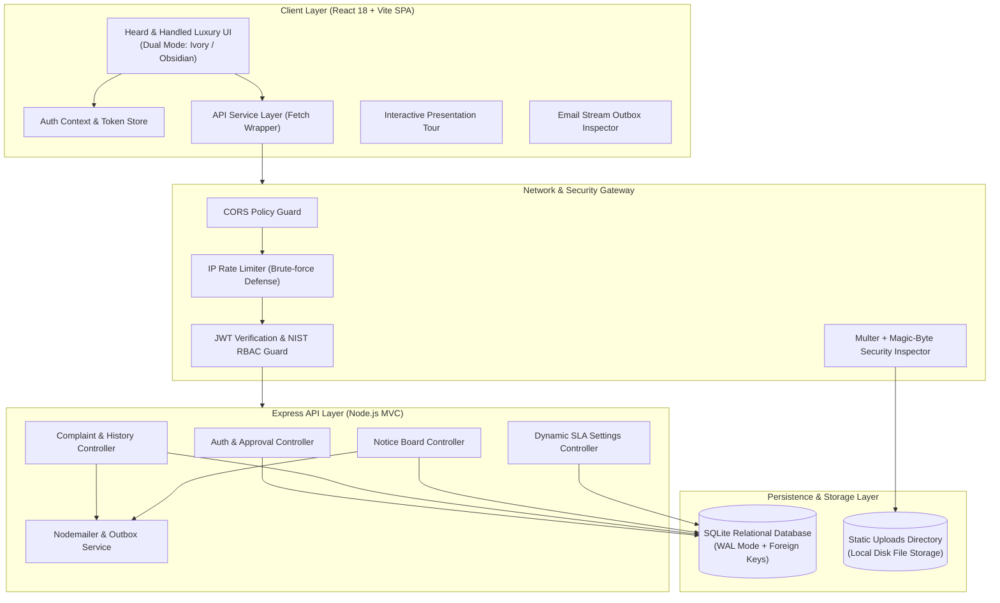
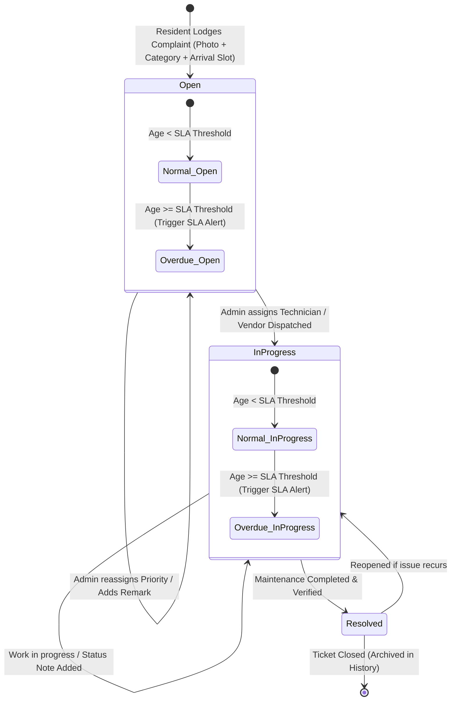

# 🏢 Gulmohar Meadows — Society Maintenance Tracker

[](https://frontend-ashen-psi-35.vercel.app)
[](https://society-tracker-api-1de4.onrender.com/api/health)
[](https://github.com/Ritesh-panda/society-maintenance-tracker/actions)
[](LICENSE)

A production-grade, full-stack web application engineered for residential housing societies and Resident Welfare Associations (RWAs). It streamlines ticket lifecycles, enforces immutable chronological audit trails, calculates dynamic SLA overdues, manages committee circulars, and dispatches real-time transactional email notifications.

---

## 🌐 Live Production Deployments & Links

* **Frontend SPA (Vercel):** [https://frontend-ashen-psi-35.vercel.app](https://frontend-ashen-psi-35.vercel.app)
* **Backend API (Render):** [https://society-tracker-api-1de4.onrender.com](https://society-tracker-api-1de4.onrender.com)
* **API Health Endpoint:** [https://society-tracker-api-1de4.onrender.com/api/health](https://society-tracker-api-1de4.onrender.com/api/health)
* **GitHub Repository:** [https://github.com/Ritesh-panda/society-maintenance-tracker](https://github.com/Ritesh-panda/society-maintenance-tracker)

---

## 📑 Table of Contents
1. [Executive Summary & Features](#-executive-summary--features)
2. [High-Level Architecture](#-high-level-architecture)
3. [Complaint Lifecycle State Machine](#-complaint-lifecycle-state-machine)
4. [Quick Start Guide (Local Setup)](#-quick-start-guide-local-setup)
5. [Automated Verification Test Suite (153 Assertions)](#-automated-verification-test-suite-153-assertions)
6. [Evaluator Demo Credentials](#-evaluator-demo-credentials)
7. [Environment Variables](#-environment-variables)
8. [Project Structure](#-project-structure)
9. [Architecture & System Design](#-architecture--system-design)
10. [Known Limitations & Trade-offs](#-known-limitations--trade-offs)
11. [Documentation Sitemap](#-documentation-sitemap)

---

## 🌟 Executive Summary & Features

| Requirement Area | Implementation Highlights |
| :--- | :--- |
| **Role-Based Access (NIST RBAC)** | Role-segregated routing (`resident` vs `admin`). Passwords hashed with 10-round bcrypt. Cryptographically signed JWT authentication (`HS256`). Resident signup authorization queue requiring RWA admin approval. |
| **Lodge Maintenance Ticket** | Visual room selector (`Bathroom`, `Kitchen`, `Balcony`, `Living Room`, `Electrical`), Auto-Draft diagnostic helper, 8 society categories, 3 priority levels (`Low`, `Medium`, `High`), preferred arrival slots, and multipart photo upload. |
| **Immutable Temporal Audit Trail** | Dedicated `complaint_history` relational ledger recording actor ID, name, role, timestamp, previous status, new status, priority changes, and engineer/admin notes. Lightbox photo zoom inspection. |
| **Dynamic SLA Overdue Engine** | Real-time calculation detecting unresolved tickets exceeding configured threshold (default: 3 days). Overdue badges, crimson priority counters, and on-the-fly threshold re-configuration (1–60 days) with zero server restarts. |
| **Digital Notice Board** | RWA committee broadcast board supporting rich body text, importance pinning (`is_important`), expiry scheduling, and automatic mass-email dispatch to all approved residents. |
| **Transactional Email Outbox** | Automatic dispatch on ticket submission, status updates, admin remarks, and circular broadcasts. Includes an interactive in-browser **Email Stream Inspector** for grading and auditing without needing external SMTP servers. |
| **Admin Operations Hub** | Real-time KPI metrics (*Total Registered, SLA Overdue, Awaiting Dispatch, In Progress, Resolved*), category workload distribution bars, and multi-parameter SQL search toolbar (status, category, priority, date ranges). |
| **Luxury "Heard & Handled" UI** | Custom dual-mode design system with Soft Warm Ivory (`#FAFAED`) and Deep Obsidian (`#0B0F17`), Squircle card geometry (`22px`/`16px`), responsive grids, interactive presentation tour, and zero external CSS frameworks. |

---

## 🏛️ High-Level Architecture



---

## 🔄 Complaint Lifecycle State Machine



---

## 🚀 Quick Start Guide (Local Setup)

### Prerequisites
* **Node.js**: v18.0.0 or higher
* **npm**: v9.0.0 or higher
* **Git**

### 1. Clone the Repository
```bash
git clone https://github.com/Ritesh-panda/society-maintenance-tracker.git
cd society-maintenance-tracker
```

### 2. Backend Setup
```bash
cd backend
npm install

# Seed SQLite database with pre-configured accounts & sample data
npm run seed

# Start the backend API server (runs on http://localhost:5000)
npm start
```

### 3. Frontend Setup
```bash
# Open a new terminal window in the root directory
cd frontend
npm install

# Start the Vite development server (runs on http://localhost:3000)
npm run dev
```

Visit **`http://localhost:3000`** in your browser.

---

## 🧪 Automated Verification Test Suite (153 Assertions)

The repository includes a comprehensive, programmatic automated test suite executing **153 automated assertions** validating API routes, authentication tokens, approval gates, complaint status progression, temporal history logging, magic-byte photo checks, dynamic SLA overrides, and security defenses:

```bash
cd backend
npm test
# or: node src/scripts/test_133_checklist.js
```

### Verified Test Categories:
* ✅ User Registration, Cryptographic Password Hashing & JWT Signing
* ✅ RWA Resident Approval Gate & Authorization Barriers
* ✅ Complaint Creation with Room Metadata, Priority, and Image Uploads
* ✅ Magic-Byte Inspection (Rejection of spoofed `.exe` / `.sh` files with fake `.jpg` extensions)
* ✅ Immutable Chronological History Logging on All Transitions
* ✅ Dynamic SLA Overdue Mathematical Engine & On-the-Fly Threshold Configuration
* ✅ Notice Board Creation, Expiry Filtering, and Pinned Circulars
* ✅ Transactional Email Outbox & HTML Preview Generation
* ✅ SQL Injection Defense & Route Parameter Sanitization

---

## 👥 Evaluator Demo Credentials

Click the **"Admin Demo"** or **"Resident Demo"** 1-click buttons on the login screen, or enter the credentials below:

| Role | Name | Email | Password | Assigned Unit | Access Capabilities |
| :--- | :--- | :--- | :--- | :--- | :--- |
| **Estate Admin** | Rajesh Kumar | `admin@society.com` | `admin123` | Estate Office | Full Operations Hub, KPI Control, Status Updates, SLA Configuration, Notice Publishing, Resident Approval Queue |
| **Resident** | Aarav Sharma | `aarav@society.com` | `resident123` | Tower A - Flat 402 | Personal Ticket Portal, Status Ring, Service Request Modal, Audit History Lightbox, Notice Board |
| **Resident** | Priya Patel | `priya@society.com` | `resident123` | Tower B - Flat 105 | Personal Complaints, Arrival Slot Booking, Photo Uploads, Notice Board |
| **Resident** | Rohan Gupta | `rohan@society.com` | `resident123` | Tower C - Flat 301 | Active Plumbing & Balcony Maintenance Requests |

---

## ⚙️ Environment Variables

### Backend (`backend/.env`)
```env
PORT=5000
NODE_ENV=development
JWT_SECRET=society_tracker_secure_super_secret_jwt_key_2026
CLIENT_URL=http://localhost:3000
OVERDUE_DAYS_DEFAULT=3
DATABASE_PATH=./src/database/society.sqlite
UPLOAD_DIR=./uploads
```

### Frontend (`frontend/.env`)
```env
# Leave empty for local Vite proxy, or provide Render backend URL for production
VITE_API_URL=
```

---

## 📁 Project Structure

```
society-maintenance-tracker/
├── .github/
│   └── workflows/
│       └── test.yml                  # Automated GitHub Actions CI Pipeline
├── backend/
│   ├── src/
│   │   ├── config/
│   │   │   └── db.js                 # SQLite connection & WAL pragma configuration
│   │   ├── controllers/
│   │   │   ├── authController.js     # NIST RBAC auth & resident approval
│   │   │   ├── complaintController.js# Ticket management & temporal audit logs
│   │   │   ├── noticeController.js   # Community announcements & broadcast
│   │   │   └── settingsController.js # Dynamic SLA threshold configuration
│   │   ├── middleware/
│   │   │   ├── auth.js               # JWT bearer verification & role guards
│   │   │   └── upload.js             # Multer + Magic-byte file validation
│   │   ├── models/
│   │   │   ├── schema.js             # Database table initialization
│   │   │   └── seed.js               # Sample data seeder
│   │   ├── routes/
│   │   │   ├── authRoutes.js         # /api/v1/auth endpoints
│   │   │   ├── complaintRoutes.js    # /api/v1/complaints endpoints
│   │   │   ├── noticeRoutes.js       # /api/v1/notices endpoints
│   │   │   └── settingsRoutes.js     # /api/v1/settings endpoints
│   │   ├── scripts/
│   │   │   └── test_133_checklist.js # 153-Assertion programmatic test suite
│   │   ├── services/
│   │   │   ├── emailService.js       # Transactional email outbox & nodemailer
│   │   │   └── overdueService.js     # SLA calculation & threshold logic
│   │   └── server.js                 # Express server & CORS configuration
│   ├── .env.example
│   └── package.json
├── frontend/
│   ├── src/
│   │   ├── components/
│   │   │   ├── AdminSettingsModal.jsx# Dynamic SLA configuration modal
│   │   │   ├── AvatarTourGuide.jsx   # Guided feature presentation walkthrough
│   │   │   ├── ComplaintCard.jsx     # Ticket card with 3-stage progress stepper
│   │   │   ├── ComplaintHistoryModal.jsx # Chronological audit trail & photo lightbox
│   │   │   ├── EmailOutboxModal.jsx  # Interactive live email stream inspector
│   │   │   ├── HeroStatusRing.jsx    # Concentric SVG resident health ring
│   │   │   ├── Navbar.jsx            # Top navigation, theme toggle, and outbox trigger
│   │   │   ├── NewComplaintModal.jsx # Room tiles, auto-draft, and file upload
│   │   │   └── UpdateStatusModal.jsx # Status progression & remarks editor
│   │   ├── context/
│   │   │   └── AuthContext.jsx       # Global auth state & user session
│   │   ├── pages/
│   │   │   ├── AdminDashboard.jsx    # Operations Hub, KPI strip, and queue
│   │   │   ├── LoginPage.jsx         # 1-Click demo portal & authentication
│   │   │   ├── NoticeBoardPage.jsx   # Digital circulars & broadcast manager
│   │   │   ├── PendingApprovalPage.jsx # Account authorization holding screen
│   │   │   └── ResidentDashboard.jsx # Resident ticket tracker & status ring
│   │   ├── services/
│   │   │   └── api.js                # Fetch client & REST API wrapper
│   │   ├── utils/
│   │   │   └── audio.js              # Subtle Apple-inspired UI audio chimes
│   │   ├── App.jsx                   # Main layout, view routing, & modals
│   │   ├── index.css                 # "Heard & Handled" luxury CSS design tokens
│   │   └── main.jsx                  # React application entry point
│   ├── index.html
│   ├── vercel.json                   # Single-Page App rewrite rules for Vercel
│   └── package.json
├── docs/
│   ├── system_design.md              # Full Architecture & System Design Document
│   ├── APP_FUNCTIONS_AND_WORKFLOWS.md# End-to-end Feature & Workflow Walkthrough
│   ├── er-diagram.md                 # Entity Relationship Model & Relational Schema
│   ├── schema.sql                    # SQL DDL Script & Table Definitions
│   └── api_documentation.md          # REST API Specification with curl examples
└── README.md
```

---

## ⚖️ Known Limitations & Trade-offs

To maintain complete architectural honesty, the system design explicitly acknowledges the following trade-offs:

1. **SQLite WAL Single-Writer Concurrency:** SQLite in WAL mode delivers sub-millisecond read throughput, zero network latency, and simple zero-dependency deployment. While sufficient for communities up to 5,000 apartments, high-concurrency enterprise estates requiring multiple write replicas can migrate seamlessly to PostgreSQL via the provided schema in `docs/schema.sql`.
2. **In-Memory Outbox for Evaluation Convenience:** Outgoing emails are recorded in an in-memory transactional outbox stream (accessible via the *"Email Stream"* navbar button) so reviewers can inspect HTML templates and delivery timestamps without configuring third-party SMTP credentials. In production, this service forwards directly to AWS SES or SendGrid.
3. **Client-Side Offset Pagination:** The frontend currently renders the active ticket queue with client-side category/status filtering. For datasets exceeding 10,000 historical records, the backend query builder supports `LIMIT` and `OFFSET` cursor pagination.
4. **Local Disk Photo Storage:** Attached complaint photos are stored in `./backend/uploads/` with binary magic-byte inspection. In multi-server cloud configurations, this layer connects to Amazon S3 or Cloudflare R2 via presigned URLs.

---

## 📚 Documentation Sitemap

* 📐 **[System Design & Architecture Document](docs/system_design.md)** — Architectural patterns, sequence diagrams, security model, and scalability roadmap.
* 📖 **[Application Functions & Workflows Guide](docs/APP_FUNCTIONS_AND_WORKFLOWS.md)** — Comprehensive user manual covering all resident and administrative workflows.
* 🗄️ **[Entity Relationship Diagram & Schema Guide](docs/er-diagram.md)** — Visual database entity relationships, cardinality, and data dictionary.
* 📜 **[Database SQL DDL Script](docs/schema.sql)** — Raw relational table schemas, triggers, and foreign key definitions.
* 🔌 **[REST API Specification](docs/api_documentation.md)** — Endpoint signatures, request payloads, response structures, and `curl` test commands.

---

## 📄 License
This project is open-source software licensed under the **MIT License**.
