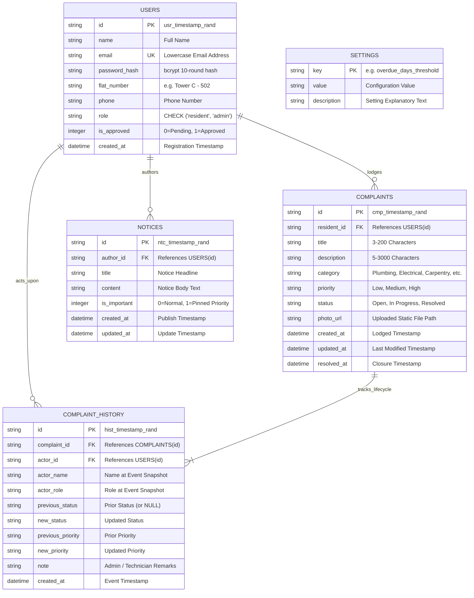

# 🗄️ Relational Entity-Relationship (ER) Diagram

The following diagram illustrates the relational data model for **Gulmohar Meadows Society Maintenance Tracker**, documenting primary keys, foreign keys, cardinality, and temporal audit relationships.

---

## 🔍 Key Relational Design Principles

1. **Temporal Immutability (`COMPLAINTS` $\rightarrow$ `COMPLAINT_HISTORY`):**
   * While `COMPLAINTS` maintains the current mutable state for fast index scans, `COMPLAINT_HISTORY` is an append-only ledger capturing every transition.
   * `ON DELETE CASCADE` ensures child audit logs are cleaned if a parent ticket is purged during test runs, while `ON DELETE SET NULL` on `actor_id` preserves history even if a user account is removed.

2. **RWA Verification Gateway (`USERS.is_approved`):**
   * Ensures newly self-registered resident accounts remain gated until explicitly validated by an estate administrator.

3. **Dynamic SLA Decoupling (`SETTINGS`):**
   * Configurable key-value store permits runtime SLA adjustments without schema migrations or server restarts.
