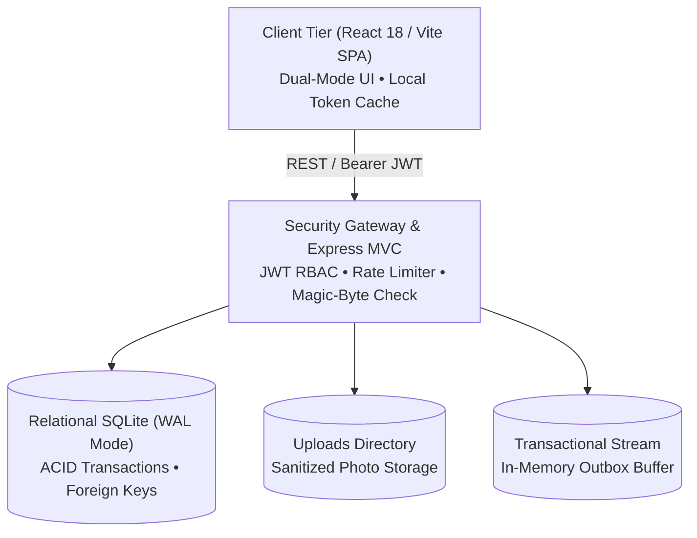

# 🏛️ System Design Document
## Gulmohar Meadows — Society Maintenance Tracker

---

## 1. Executive Architecture Overview
The **Society Maintenance Tracker** is a decoupled, multi-tier web platform designed to eliminate operational opacity and coordination bottlenecks in residential communities.

---

## 2. Temporal Append-Only History Model
To ensure accountability, the system uses an **Append-Only Temporal Ledger Pattern**:
* **Entities:** `complaints` stores current operational state (`status`, `priority`, `resolved_at`), while `complaint_history` stores immutable chronological event snapshots.
* **Atomic Transitions:** Status updates (`Open` $\rightarrow$ `In Progress` $\rightarrow$ `Resolved`) execute in ACID transactions:
  1. The `complaints` record updates its state.
  2. A new `complaint_history` row captures `(complaint_id, actor_id, actor_name, actor_role, previous_status, new_status, note, timestamp)`.
  3. Setting `Resolved` populates `resolved_at`, locking the ticket.
* **Audit Immutability:** Residents and administrators can inspect the full chronological chain of custody and staff remarks with complete transparency.

---

## 3. Dynamic SLA & Overdue Engine
To prevent tickets from aging unnoticed, the platform evaluates SLAs dynamically at query time:

### Mathematical Formulation
Given complaint $C$ and configurable threshold $\theta_{\text{days}} \in [1, 60]$ (default: $3$):

$$\text{Age}_{\text{days}} = \left\lfloor \frac{T_{\text{current}} - T_{\text{created}}}{86,400,000} \right\rfloor$$

$$\text{IsOverdue}(C) = (C.\text{status} \neq \text{'Resolved'}) \land (\text{Age}_{\text{days}} \ge \theta_{\text{days}})$$

### Priority Queue Sort Hierarchy
The administrative queue is prioritized via a 3-tier comparator:
1. **Tier 1:** Overdue unresolved tickets (flashing red alert).
2. **Tier 2:** Priority weighting (`High` $>$ `Medium` $>$ `Low`).
3. **Tier 3:** Chronological recency (`created_at DESC`).

Thresholds can be reconfigured dynamically by administrators via `/api/v1/settings/sla-threshold` with zero server restarts.

---

## 4. Photo Evidence & Security Pipeline
1. **Upload Pipeline:** Submissions accept multipart form-data via `multer`.
2. **Validation:** Files undergo MIME validation (`image/jpeg`, `image/png`, `image/webp`), binary **magic-byte header sniffing** (`0xFFD8FF`, `0x89504E47`, `0x52494646`), and a 5 MB size cap.
3. **Storage & Serving:** Files are stored with cryptographically randomized timestamp prefixes and served with `X-Content-Type-Options: nosniff`.
4. **Lightbox UI:** Thumbnails are embedded in ticket cards with 1-click modal zoom.

---

## 5. Event-Driven Transactional Notifications
1. **Status Progression:** When a ticket status changes, `sendComplaintStatusEmail` dispatches a responsive HTML notification to the reporting resident.
2. **Notice Broadcast:** When an administrator posts an announcement with `is_important = 1`, the system broadcasts circulars to all active residents.
3. **Grading Outbox Stream:** An in-memory outbox buffer (`/api/v1/settings/email-outbox`) captures dispatched emails, enabling reviewers to inspect full rendered templates without external SMTP credentials.

---

## 6. Security Architecture & Threat Model

| Threat | System Mitigation |
| :--- | :--- |
| **Auth Forgery** | Cryptographically signed `HS256` JWTs (7-day TTL) + bcrypt password hashing (10 rounds). |
| **RBAC Escalation** | Route-level role guards (`requireRole('admin')`) + RWA resident approval queue (`is_approved = 0` gating). |
| **Malicious Uploads** | Dual-layer validation (extension whitelist + buffer magic bytes inspection). |
| **SQL Injection** | Parameterized SQL prepared statements with positional binding (`?`). |
| **XSS Attacks** | Automatic React JSX string escaping and backend payload sanitization. |

---

## 7. Known Limitations & Trade-offs

| Design Decision | Rationale & Trade-off | Production Scalability Path |
| :--- | :--- | :--- |
| **SQLite (WAL Mode)** | Zero-config, sub-millisecond local reads, ACID atomicity. Limit: single concurrent writer. | Drop-in migration to **PostgreSQL RDS** with connection pooling via `docs/schema.sql`. |
| **In-Memory Outbox** | Allows immediate grading without live third-party SMTP credentials. Reset on restart. | Connect to **AWS SES** / **SendGrid** via a distributed queue (**Redis BullMQ**). |
| **Client-Side Filters** | Zero-latency instant search for residential datasets ($<5,000$ complaints/year). | Add server-side cursor pagination (`?cursor=...&limit=25`) for enterprise volumes ($100k+$). |
| **Local Disk Photos** | Lightweight and self-contained with no cloud billing dependencies. | Migrate to **Amazon S3** / **Cloudflare R2** with presigned upload URLs. |
