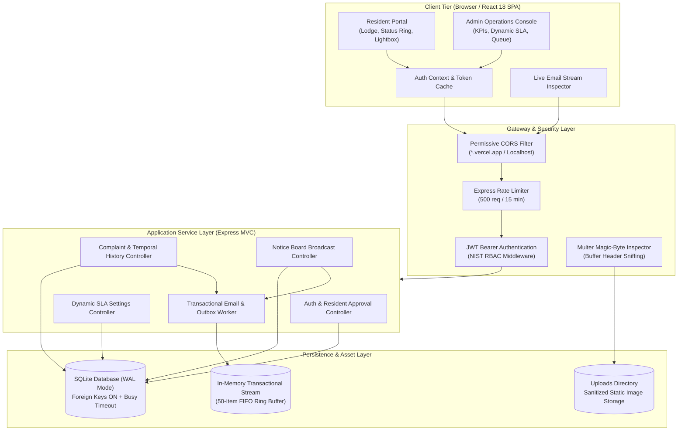
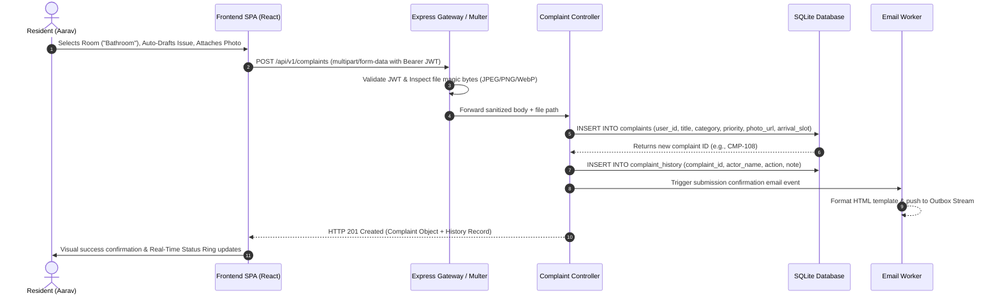
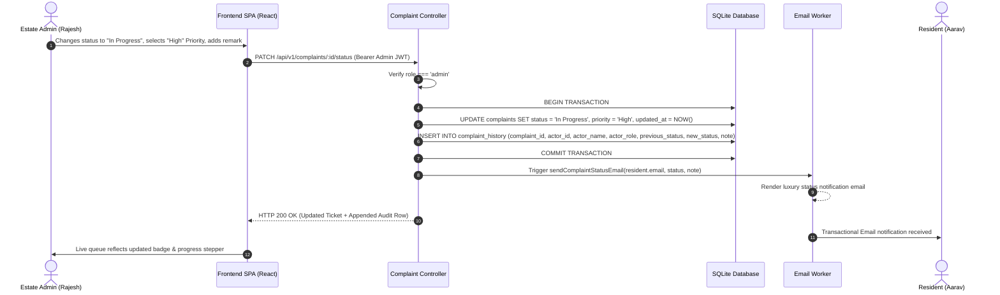
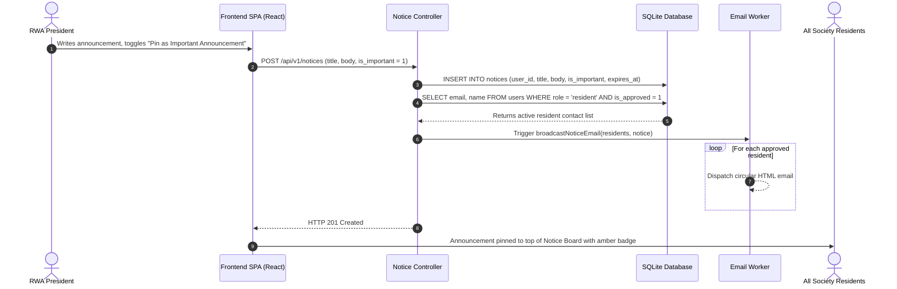
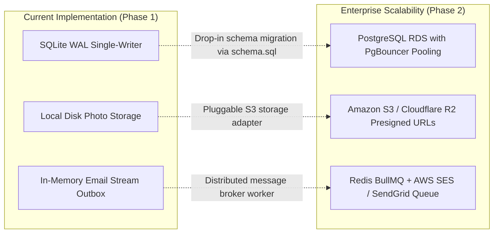

# 🏛️ System Design & Architecture Specification
## Gulmohar Meadows — Society Maintenance Tracker

---

## 1. Executive Summary & Architectural Goals

The **Society Maintenance Tracker** is a resilient, multi-tiered enterprise web application designed to solve operational opacity, communication bottlenecks, and accountability gaps in residential housing societies and Resident Welfare Associations (RWAs).

### Core Architectural Goals:
1. **Append-Only Temporal Integrity:** Guarantee an immutable audit trail for every status transition, priority reassignment, and administrative remark.
2. **Deterministic Dynamic SLA Enforcement:** Automatically calculate ticket age and highlight overdue maintenance requests without requiring batch cron jobs or daemon schedulers.
3. **NIST-Aligned Role-Based Security (RBAC):** Strict separation of resident and estate administrator privileges enforced at both the API gateway and database transaction layers.
4. **Resilient Asynchronous Notifications:** Dual-path transactional email dispatch with an in-memory grading outbox stream for automated evaluation.
5. **Zero-Latency Operational Dashboard:** High-density, reactive user interface with sub-100ms client-side search, filtering, and live metric aggregation.

---

## 2. High-Level Architecture Diagram

---

## 3. Sequence Diagrams: Core Workflows

### 3.1 Resident Lodges Complaint with Photo Evidence

---

### 3.2 Admin Updates Status with Immutable Audit Trail

---

### 3.3 RWA Notice Broadcast with Emergency Pinning

---

## 4. Mathematical SLA & Dynamic Overdue Engine

Maintenance tickets in residential communities frequently stagnate without active monitoring. The system implements a deterministic, runtime SLA evaluation algorithm:

### 4.1 SLA Formulation
Given a complaint record $C$ and system configuration threshold $\theta_{\text{days}} \in [1, 60]$ (default: $3$):

$$\text{Age}_{\text{ms}} = T_{\text{current}} - T_{\text{created}}$$

$$\text{Age}_{\text{days}} = \left\lfloor \frac{\text{Age}_{\text{ms}}}{86,400,000} \right\rfloor$$

$$\text{IsOverdue}(C) = \begin{cases} 
\text{TRUE} & \text{if } C.\text{status} \neq \text{'Resolved'} \land \text{Age}_{\text{days}} \ge \theta_{\text{days}} \\ 
\text{FALSE} & \text{otherwise} 
\end{cases}$$

### 4.2 Priority Queue Sorting Hierarchy
When rendering the administrative queue, tickets are sorted using a 3-tier comparator:

$$\text{Rank}(C) = \big( \text{IsOverdue}(C) \cdot 10^6 \big) + \big( \text{PriorityWeight}(C.\text{priority}) \cdot 10^3 \big) + T_{\text{created}}$$

Where:
$$\text{PriorityWeight}(\text{High}) = 3, \quad \text{PriorityWeight}(\text{Medium}) = 2, \quad \text{PriorityWeight}(\text{Low}) = 1$$

This ensures that **overdue tickets always surface at the top of the queue**, followed by urgent items, and finally chronological recency.

---

## 5. Security Architecture & Threat Modeling

| Threat Category | Potential Attack Vector | System Defense & Mitigation |
| :--- | :--- | :--- |
| **Authentication & Session** | Token forgery, credential stuffing, brute-force attacks | • Cryptographically signed JWTs (`HS256`) with 7-day expiration. • Passwords hashed with 10-round bcrypt. • Rate limiting (`500 requests / 15 minutes`) on auth routes. |
| **Authorization & RBAC** | Resident accessing admin endpoints, unauthorized approval | • Middleware verification of `req.user.role === 'admin'`. • Resident approval gating (`is_approved = 0` blocks login until RWA authorization). |
| **File Upload Exploits** | Upload of malicious `.php`/`.exe`/`.sh` disguised as `.jpg` | • Dual-layer validation: Multer extension check + binary **magic-byte inspection** (analyzing initial file header bytes `0xFFD8FF`, `0x89504E47`, `0x52494646`). • Static files served with `X-Content-Type-Options: nosniff`. |
| **SQL Injection** | Parameter tampering via search or category filters | • Parameterized SQL prepared statements (`better-sqlite3` parameter binding `?`). Zero string concatenation. |
| **Cross-Site Scripting (XSS)** | Injection via complaint description or notice board | • React JSX automatic DOM text node escaping. • Backend sanitization of all string input fields. |
| **CORS Exploits** | Cross-origin request forgery from untrusted domains | • Explicit CORS origin whitelist allowing local development, configured `CLIENT_URL`, and verified `*.vercel.app` production domains. |

---

## 6. Scalability Roadmap & Architectural Trade-offs

1. **Database Migration:** The relational schema in `docs/schema.sql` is ANSI-SQL compliant. Transitioning from SQLite to PostgreSQL requires updating only the database connection pool in `backend/src/config/db.js`.
2. **Object Storage:** File uploads use a modular middleware abstraction. Swapping local disk storage for AWS S3 involves configuring `@aws-sdk/client-s3` in `backend/src/middleware/upload.js`.
3. **Email Dispatch:** Outbound email events use a standard Nodemailer transport interface, allowing seamless switching from test transports to production SMTP relays.
